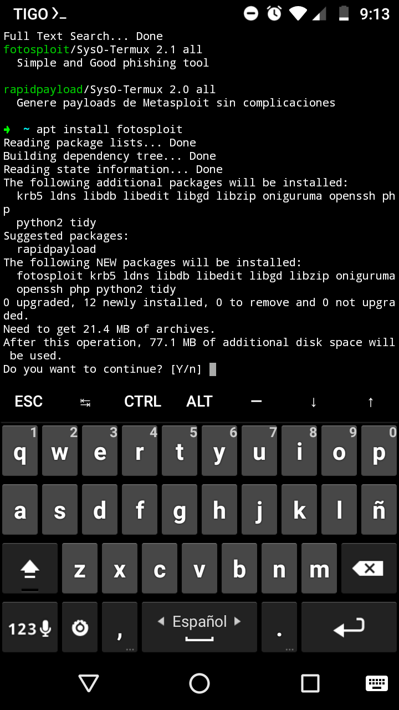
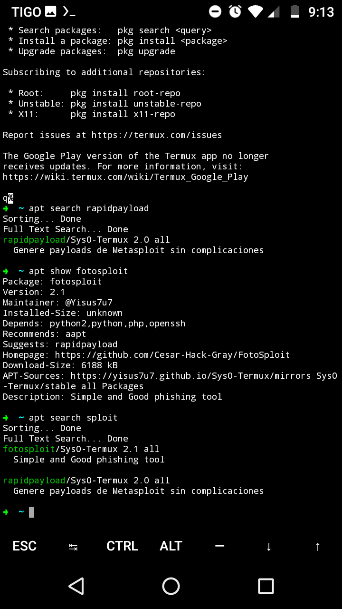

# SysO-Termux
It is a fork of SysO-Termux with improvements and a repository with tools 

### ¿Qué es SysO-Termux?

Este es un fork de [Darkmux](https://github.com/Darkmux/SysO-Termux)
el cual instala un repositorio con herramientas de
piratería en termux

 

 

## ¿Cómo instalarlo? 

Ingrese estos comandos en su terminal :

```
pkg update && pkg install -y wget curl
```
```
curl https://raw.githubusercontent.com/Yisus7u7/SysO-Termux/main/SysO-termux.ports.sh | bash
```

### ¿Cómo contribuir?
Puede ayudar compilando paquetes y haciendo 
solicitudes de extracción con corrección de errores

### ¿Sugerencias, errores?
Si cree que hace falta una herramienta y debe 
ser añadida, haga [clik aquí](https://github.com/Yisus7u7/SysO-Termux/issues)
y haga una solicitud de paquete, también puede reportar 
bugs ahí


No olvides dejar tu 🌟 y compartir con tus amigos 
